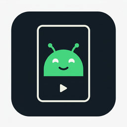

# PixelEmu Studio

<p align="center">
  
</p>

<!-- Замени <ТВОЙ_НИК> на свой ник GitHub после публикации репозитория -->
[](#-скачать-готовый-exe)


[](LICENSE)

**Эмулятор Android-устройств Google Pixel (пресет Pixel 7 Pro) для Windows 10/11.**
Оболочка написана на **Python 3.13** (GUI и оркестрация) + **C++** (нативное ядро
`pixemu-core.exe`, компилятор **MinGW из MSYS2**). Эмуляция выполняется
**официальным движком Google Android Emulator** (QEMU-базированным), который
программа сама скачивает с серверов `dl.google.com`, а система — **официальные
образы Google** (Google Play / Google APIs / AOSP) — то есть та самая
«пиксельная» ОС, которую Android Studio показывает в AVD «Pixel 7 Pro».

---

## ⬇ Скачать готовый EXE

**Python и MSYS2 не нужны** — релиз один файл `PixelEmuStudio.exe`
(C++-ядро встроено внутрь):

1. Открой раздел **Releases** справа → скачай `PixelEmuStudio-X.Y.Z-windows-x64.zip`.
2. Распакуй куда угодно и запусти `PixelEmuStudio.exe`.
3. Настройки ⚙ → «Скачать движок эмулятора» → ➕ «Создать эмулятор» → ▶ «Запустить».

> Релиз собирается автоматически GitHub Actions из этого репозитория
> (`.github/workflows/release.yml`) при пуше тега `v*`.

---

## ⚠️ Честно о технических ограничениях

1. **Заводской образ Pixel 7 Pro (factory image) на эмуляторе не загрузится** —
   он собран под железо Tensor G2 с проприетарными драйверами. Поэтому легальный
   и рабочий способ получить «ОС Пикселя» в эмуляторе — официальные системные
   образы Google Play: Pixel Launcher, Play Маркет, GMS — всё на месте.
2. **Гипервизор «с нуля» на Python написать нельзя** — производительность была бы
   в тысячи раз ниже. Именно поэтому Android Studio тоже использует готовый
   QEMU-движок. Мы поступаем так же, но с собственным интерфейсом и ядром на C++.

---

## Требования

| Компонент | Минимум |
|---|---|
| ОС | Windows 10 22H2 / 11, 64-бит |
| CPU | Intel VT-x или AMD-V (включена виртуализация в BIOS) |
| RAM | 8 ГБ (рекомендуется 16 ГБ) |
| Диск | ~10 ГБ свободно (движок 0.4 ГБ + образ 2–3 ГБ + AVD) |
| Python | 3.13 (проверялось на 3.13.12–3.13.14), внешних pip-зависимостей НЕТ |
| MSYS2 | для сборки C++-ядра (опционально — уже собранный `native/bin/pixemu-core.exe` входит в поставку) |

### Включите аппаратное ускорение (WHPX)

В PowerShell **от имени администратора**:

```powershell
dism /online /enable-feature /featurename:HypervisorPlatform /all
dism /online /enable-feature /featurename:VirtualMachinePlatform /all
```

Перезагрузите ПК. Без этого эмулятор будет работать в разы медленнее.

---

## Установка и запуск (из исходников)

```powershell
git clone https://github.com/<ТВОЙ_НИК>/pixemu-studio.git
cd pixemu-studio
run.bat                                     # либо: python -m launcher
```

При первом запуске:

1. Откроется менеджер (список AVD пуст).
2. **⚙ Настройки / Движок → «Скачать движок эмулятора»** (~400 МБ, официальный
   стабильный Android Emulator от Google). Там же — «Проверить ускорение».
3. **➕ Создать эмулятор** — запустится мастер:

| Шаг | Что выбираете |
|---|---|
| 1. Устройство | **Pixel 7 Pro** (1440×3120, 560 dpi — профиль как в Android Studio), Pixel 7, Pixel 6a или своя конфигурация + имя AVD |
| 2. Образ системы | источник (Google Play / Google APIs / AOSP) и версия Android (API 28–37.x, x86_64/arm64) — список подгружается с серверов Google |
| 3. Характеристики | **RAM, ядра vCPU, разрешение, DPI, постоянную память, SD-карту** |
| 4. Режим эмуляции | GPU (auto/host/ANGLE/SwiftShader), тип загрузки, камера/микрофон/GPS, свои флаги |
| 5. Загрузка | сводка → принятие лицензии SDK → скачивание образа (2–3 ГБ, SHA-1 проверяется) → создание AVD |

4. **▶ Запустить** — первая загрузка Android занимает 2–5 минут.

---

## Сборка C++-ядра (MinGW / MSYS2)

Ядро (`download`/`sha1`/`run` через WinHTTP, BCrypt, CreateProcess) ускоряет
загрузки; без него программа автоматически использует Python-загрузчик.

```powershell
# 1) Установите MSYS2: https://www.msys2.org
# 2) В терминале «MSYS2 UCRT64»:
pacman -S mingw-w64-ucrt-x86_64-gcc make
# 3) Вариант А — из проводника/PowerShell:
powershell -ExecutionPolicy Bypass -File build_native.ps1
#    Вариант Б — из терминала MSYS2:
cd native && make
```

Результат: `native/bin/pixemu-core.exe` (программа находит его сама).

---

## 📦 Сборка релиза самому (EXE)

```powershell
powershell -ExecutionPolicy Bypass -File build_release.ps1
```

Скрипт: соберёт C++-ядро → прогонит тесты → PyInstaller сделает
**один** `dist\PixelEmuStudio.exe` (ядро `pixemu-core.exe` встроено внутрь,
извлекается в `%TEMP%` при запуске) → упакует `dist\PixelEmuStudio-X.Y.Z-windows-x64.zip`.

## 🐙 Публикация на своём GitHub

```powershell
git init
git add .
git commit -m "PixelEmu Studio 1.1.0"
git branch -M main
git remote add origin https://github.com/<ТВОЙ_НИК>/pixemu-studio.git
git push -u origin main

git tag v1.1.0
git push origin v1.1.0        # ← запустит Actions: тесты → сборка → Release с ZIP
```

После этого: вкладка **Actions** покажет сборку (≈5 мин), а в **Releases**
появится `PixelEmuStudio-1.1.0-windows-x64.zip`. Не забудь заменить
`<ТВОЙ_НИК>` в бейджах и ссылках README на свой ник.

---

## Структура проекта

```
pixemu-studio/
├── launcher/                 # Python 3.13 (только stdlib)
│   ├── __main__.py           # точка входа: python -m launcher
│   ├── app.py                # GUI: менеджер AVD + мастер создания + лог
│   ├── presets.py            # профили Pixel 7 Pro / 7 / 6a / custom
│   ├── config.py             # модель конфигурации AVD (JSON)
│   ├── repo.py               # разбор официальных XML-манифестов Google
│   ├── netio.py              # загрузки + мост к C++-ядру (умеет _MEIPASS)
│   ├── avd.py                # генерация AVD (config.ini в формате avdmanager)
│   ├── engine.py             # установка движка, диагностика, запуск
│   └── util.py
├── native/
│   ├── src/main.cpp          # C++17 ядро pixemu-core (WinHTTP/BCrypt/CreateProcess)
│   └── Makefile
├── assets/icon.png|ico       # иконка приложения
├── tests/test_repo.py        # тесты парсеров манифестов Google
├── tests/test_install.py     # регрессионные тесты багов 1.0.x
├── pixemu_studio.py          # точка входа (PyInstaller / python pixemu_studio.py)
├── pixemu-studio.spec        # spec для PyInstaller (onefile)
├── build_native.ps1          # сборка C++-ядра
├── build_release.ps1         # полная сборка релиза (ядро+тесты+exe+zip)
├── .github/workflows/release.yml   # CI: тег v* → тесты+сборка+GitHub Release
├── .github/ISSUE_TEMPLATE/bug_report.md
├── LICENSE                   # Apache-2.0 (код проекта)
├── CONTRIBUTING.md
├── run.bat
└── README.md
```

Данные (движок/образы/AVD) лежат в `%LOCALAPPDATA%\PixEmuStudio` — меняется в
настройках. Папка `platform-tools` (adb) ставится кнопкой в «Настройках».

---

## Решение проблем

| Симптом | Что делать |
|---|---|
| `ERROR: unknown skin name '_no_skin'`, выход с кодом 1 после прохождения всех проверок | **Исправлено в 1.0.4**: магическое имя `_no_skin` в новых версиях эмулятора не поддерживается. Теперь пишется динамический скин по размеру экрана (`skin.name=1440x3120`). Обновите файлы и перезапустите — config.ini пересоздаётся сам |
| `FATAL: Broken AVD system path. Check your ANDROID_SDK_ROOT value` | **Исправлено в 1.0.3**: путь к образу писался с экранированием, которое парсер эмулятора не понимает. Теперь `image.sysdir.1` — относительный путь в формате avdmanager. Обновите файлы и нажмите «Запустить» — config.ini пересоздаётся сам при каждом запуске |
| `FATAL: CPU Architecture 'arm' is not supported by the QEMU2 emulator` при запуске | **Исправлено в 1.0.2**: в `config.ini` не хватало ключа `hw.cpu.arch` — эмулятор без него считал AVD 32-битным ARM |
| Программа просит скачать образ снова после скачивания (файлы в папке `x86_64\x86_64\…`) | **Исправлено в 1.0.1**: архивы Google содержат вложенную папку ABI, теперь она «срезается» при распаковке. Старые распаковки чинятся автоматически при запуске — **перекачивать не нужно** |
| Эмулятор молча закрывается сразу после запуска | Смотри журнал (включён `-verbose`). Частая причина — неподдерживаемый флаг в «Доп. флагах» или кастомный GPU-режим; верните `auto`. Имя AVD — только латиницей (кириллица транслитерируется автоматически) |
| Чёрный экран после логотипа | GPU-режим: смените на `angle_indirect`, затем `swiftshader_indirect` (кнопка «Изменить» через пересоздание или флаги) |
| «WHPX не найден» | Включите компоненты «Платформа гипервизора Windows» и «Платформа виртуальной машины», перезагрузитесь. Настройки → «Проверить ускорение» покажет диагноз (`-accel-check`) |
| Очень медленно | Убедитесь, что работает WHPX; уменьшите RAM/разрешение; выбирайте образ **x86_64**, а не ARM |
| Конфликт с Hyper-V/VBS | Современный движок дружит с WHPX; если нет — «Проверка ускорения» подскажет |
| Ошибка контрольной суммы | Удалите файл в `downloads` и повторите — сеть «обрезала» архив |
| adb не находится | Настройки → «Скачать platform-tools», adb будет в `<SDK>\platform-tools\adb.exe` |

## Лицензии

- Код проекта — [Apache License 2.0](LICENSE).
- Скачиваемые программой компоненты Google (движок эмулятора, системные
  образы, platform-tools) — © Google, распространяются по условиям
  [Android SDK License](https://developer.android.com/studio/terms), которую вы
  принимаете на последнем шаге мастера перед загрузкой образа.

## Changelog

- **1.1.3** — fix: тесты сами переводят stdout в UTF-8 (`UnicodeEncodeError`
  на cp1251-консолях), скрипт сборки задаёт `PYTHONIOENCODING=utf-8`.
- **1.1.2** — fix: сборка под PowerShell: маски `launcher\*.py` заменены на
  `python -m compileall` (PowerShell их не раскрывает), UTF-8-вывод в консоль.
  Тот же fix внесён в CI-workflow.
- **1.1.1** — fix: скрипты `*.ps1` сохранены в UTF-8 **с BOM** — Windows
  PowerShell 5.1 больше не падает с `ParserError/UnexpectedToken` на кириллице;
  `run.bat` переведён на ASCII.
- **1.1.0** — релиз: onefile-EXE (PyInstaller, C++-ядро внутри), иконка,
  GitHub Actions workflow, настройки в `%LOCALAPPDATA%\PixEmuStudio`, Apache-2.0.
- **1.0.4** — fix: `unknown skin name '_no_skin'` → динамический скин WxH; `-no-metrics`.
- **1.0.3** — fix: `Broken AVD system path` → `image.sysdir.1` относительный.
- **1.0.2** — fix: `CPU Architecture 'arm' is not supported` → ключ `hw.cpu.arch`.
- **1.0.1** — fix: образ качался «по кругу» (вложенная папка ABI в архиве Google);
  самолечение старых распаковок; транслитерация имён AVD.
- **1.0.0** — первая версия.
```
